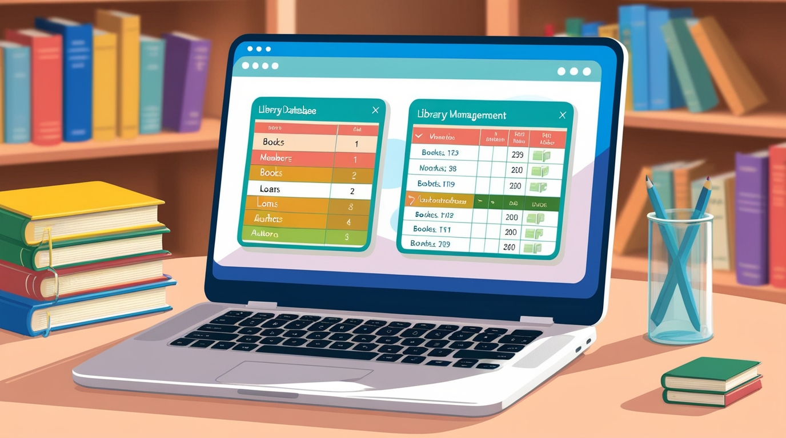
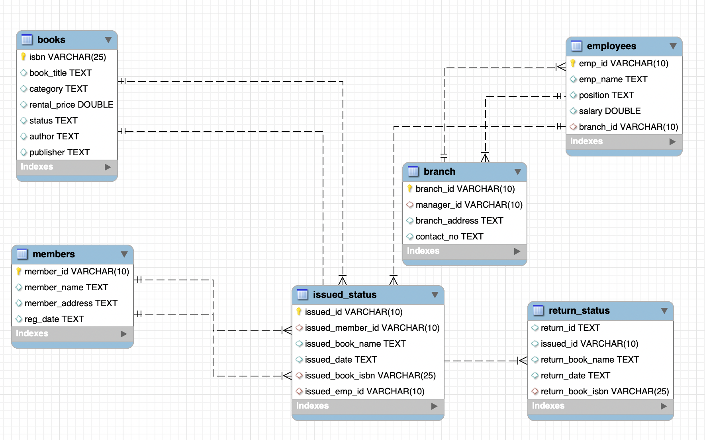

# Library Management System (LMS) – SQL Project

## 📚 Project Overview

The Library Management System project models how a real library manages its data.
It includes information about books, members, employees, library branches, issued books, and returned books.
This project demonstrates SQL skills such as database design, data cleaning, joins, constraints, aggregation, and analytical querying.

The goal is to build a complete multi-table relational database and generate insights through SQL analysis.

---

## 🖼 Library Management System Overview

---

## 🏗 Database Structure

The database consists of several related tables that represent core library operations.

### 📦 Tables Included

* books – book information
* members – registered users
* employees – library staff
* branch – different library locations
* issued_status – issued book records
* return_status – returned book records

These tables together form the complete library workflow.

---

## 🔄 Entity Relationship Diagram (ERD)

The ERD provides a visual representation of relationships between the tables.

---

## 📁 Dataset Included

This project uses the following CSV files:

* books.csv
* branch.csv
* employees.csv
* members.csv
* issued_status.csv
* return_status.csv

These datasets are stored in the project folder and used to build the SQL database.

---

## 🎯 Objectives

### 1. Create the Database

* Build a normalized SQL database (library_db)
* Create all tables with correct data types
* Add primary keys and foreign keys
* Establish relationships between tables

### 2. Perform Data Cleaning

* Identify missing or invalid values
* Validate foreign key relationships
* Remove inconsistent records

### 3. Load Data

* Import all CSV files into their respective SQL tables

### 4. Run Analysis and Generate Insights

* Most issued books
* Most active members
* Branch-wise issuing patterns
* Books not returned or overdue
* Employee activity and performance
* Monthly and yearly issuing trends

---

## 🧱 Project Structure

02-library-management-system/
│
├── books.csv
├── branch.csv
├── employees.csv
├── members.csv
├── issued_status.csv
├── return_status.csv
├── library_management.png
├── erd.png
└── lms_project.sql

---

## 🧪 SQL Tasks Performed

### Database Setup

* Created the full LMS database
* Built all tables with constraints
* Defined primary keys and foreign keys

### Data Cleaning

* Checked for NULL values
* Validated IDs across related tables
* Ensured category and branch consistency

### Data Loading

* Imported all CSV data into tables

### Analysis Queries

The SQL file includes analysis such as:

* Most borrowed books
* Members with highest activity
* Branch-wise issuing volume
* Books issued but not returned
* Late return detection
* Employee-specific issuing stats
* Category-wise book demand

---

## 📊 Key Insights

* Some book categories show high demand
* Certain members borrow more frequently than others
* A few employees handle most book transactions
* Branch activity differs significantly
* Overdue books help identify high-demand titles

---

## 🛠 Tools Used

* MySQL / PostgreSQL
* DBeaver / MySQL Workbench
* Excel / Google Sheets
* Draw.io (ERD creation)

---

## 🏁 Conclusion

This project demonstrates real-world SQL skills through database creation, cleaning, analysis, and insight generation.
It shows how SQL can be used to manage library operations and support decision-making.

---

## 👤 Author

Navin Bohara

---

