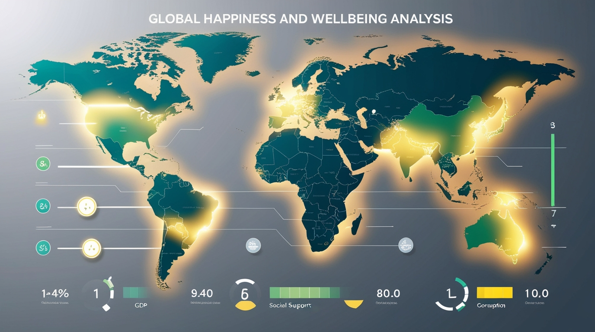

# **04-world-happiness-analysis – SQL Project**

## 📘 Project Overview

This project analyzes the **World Happiness Report dataset** using SQL.
The dataset includes multiple factors that influence a country’s overall happiness score such as GDP, social support, corruption perception, freedom, generosity, and healthy life expectancy.

The goal of this project is to use SQL to explore global patterns, rank countries, compare regions, and uncover insights about well-being across the world.

---


## 📸 Project Visuals (Optional)

Upload visuals into the folder and reference them here:

```

```

---

## 🌍 Dataset Description

The dataset contains the following key columns:

* **Country**
* **Regional indicator**
* **Ladder score (Happiness score)**
* **GDP per capita**
* **Social support**
* **Healthy life expectancy**
* **Freedom to make life choices**
* **Generosity**
* **Perceptions of corruption**

These values provide a holistic view of each country's social and economic environment.

---

## 🎯 Objectives

This project focuses on answering key analytical questions, including:

* Identifying the happiest and least happy countries
* Ranking countries within each region
* Finding countries above or below global averages
* Discovering correlations between GDP and happiness
* Finding regional disparities in happiness
* Detecting outliers and exceptional cases
* Analyzing social factors such as freedom, corruption, and generosity

---

## 🧠 SQL Tasks Performed

### 🟦 Basic Analysis

* Top 10 happiest countries
* Least happy country in each region
* Regional ranking by Ladder score

### 🟩 Economic & Social Insights

* Countries above global GDP average
* Countries with low social support but high happiness
* Correlation between GDP and happiness
* Region-wise average happiness
* Countries with lowest corruption

### 🟧 Advanced Analytics

* Generosity vs regional average
* Countries below happiness threshold
* Top 3 countries per region by freedom
* Life expectancy outperforming GDP rank
* Regional GDP totals and averages
* Country with biggest generosity vs corruption gap
* Countries above global averages in GDP, social support and freedom

### 🟥 Statistical & Outlier Analysis

* Region with highest happiness score spread
* Outliers: ±2 points from regional average

---

## 📁 Project Structure

```
04-world-happiness-analysis/
|
|-- world_happiness.csv
|-- world_happiness_analysis.sql
└-- README.md
```

## 🛠 Tools Used

* MySQL
* Window Functions
* CTEs
* Subqueries
* Excel (CSV cleaning)
* GitHub for version control

---

## 📌 Key Insights

* Some regions consistently outperform others in overall well-being
* Economic strength (GDP) positively correlates with Ladder score
* Social support and freedom strongly influence happiness
* Countries with very low corruption are not always the happiest
* Large disparities exist even within the same region

---

## 👤 Credit

Created by **Navin Bohara**
Part of the **SQL Analytics Portfolio**

GitHub: [https://github.com/NavinBohara](https://github.com/NavinBohara)
LinkedIn: [https://linkedin.com/in/navinbohara](https://linkedin.com/in/navinbohara)

---


